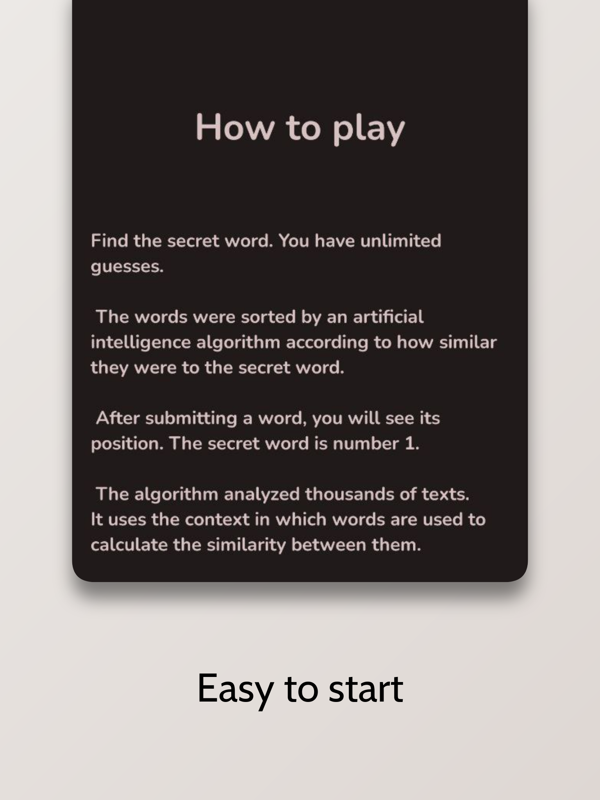

	<!-- Title -->
	 
	<b>LibreContexto</b>
	 
	Libre client for contexto.me

  

| 

 | 

 |
|-----|--------|

## ❓ What is this game?
The point of the game is to guess the word of the day. The secret word has the number 1, other words have relatively from this word by sence more number. The closer this number is to 1, the closer your word is to the secret word.

## 🧑‍💻 Why I made my client
I didn't like the fact that the client was Web-based, didn't have Monet icons, and didn't have MDY/MY.

## 📋 TODO
- [ ] Saving progress
- [ ] Make a different design
- [ ] The ability to write through a word translator
- [ ] Submit to the FDroid repository

## 💖 Contributing
I'd always be happy for help!

## ⭐️ Developer
- [@CakesTwix](https://www.github.com/CakesTwix)
 
 
